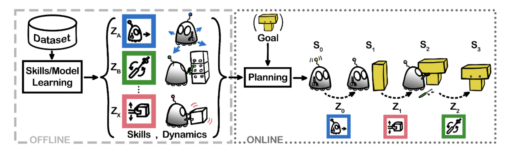

### Abstract
Agents building temporally abstract representations of their environment can better understand their world and make plans on extended time scales with limited computational power and modeling capacity. Existing methods for learning world models either operate per timestep or assume a fixed number of timesteps for abstraction. Our approach simultaneously learns variable-length skills and temporally abstract, skill-conditioned world models from offline data. This leads to much higher confidence in dynamics predictions allowing zero-shot online planning by composing skills for new tasks. Furthermore, compared to policy-based methods, this approach offers a much higher degree of robustness to perturbations in environmental dynamics.

#### Overview of offline skill learning

During the offline training phase, our algorithm automatically extracts *semantically meaningful skills* and skill conditioned dynamics model from the offline data. During the online planning phase, the planner uses the learned skill conditioned dynamics model to plan a sequence of skills to achieve the goal.

### Legend
#### Notation
- Environment state: $s$
- Action: $a$
- trajectory: $\tau$
- skill: $z$
#### Components
- Skill prior: $z \sim p_{\omega}(z | s_0)$
- Abstract dynamics model: $s_T \sim p_{\psi}(s_T | s_0, z)$
- Lower level policy: $a_t \sim \pi_{\theta}(a_t | s_t, z)$
- Termination predictor: $b_t = p_{\phi}(s_t, z, s_T) > 0.5$

### Results
#### Planning procedure
<iframe width="854" height="480" src="https://www.youtube.com/embed/jgAlwWdpMzI" title="Maze2d planning" frameborder="0" allow="accelerometer; autoplay; clipboard-write; encrypted-media; gyroscope; picture-in-picture; web-share" allowfullscreen></iframe>
During the offline skill extraction phase, we learn a state conditioned prior ($p_{\omega}$) that outputs a priori skill distribution given environment state ($p_{\omega}(z|s_t)$). We use this to sample a batch of skills. These sampled skills are inputed to the abstract dynamics model ($p_{\psi}$) that predicts the terminal state distribution for each of the skill sample ($s_T \sim p_{\psi}(s_T|s_0, z)$). Hence, we select a subset of the skills with terminal states closest to the goal state. Finally, we use the selected skills to execute in the environment.

#### Execution of the selected skills
<iframe width="854" height="480" src="https://www.youtube.com/embed/NuXD62qTcoM" title="" frameborder="0" allow="accelerometer; autoplay; clipboard-write; encrypted-media; gyroscope; picture-in-picture; web-share" allowfullscreen></iframe>
For execution we pass the selected skill and the environment state through the lower level policy ($\pi_{\theta}$) that predicts the action to execute ($a_t \sim \pi_{\theta}(a_t|s_t, z)$). The action is then executed in the environment and the next state is observed. This process is repeated until termination is predicted by the termination predictor ($b_t = 1 = p_{\phi}(s_t, z, s_T) > 0.5$).
