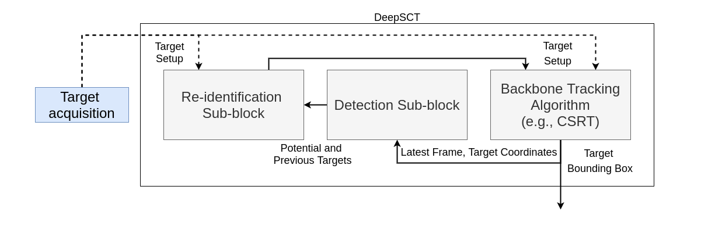
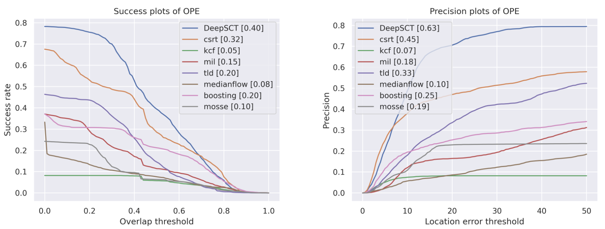
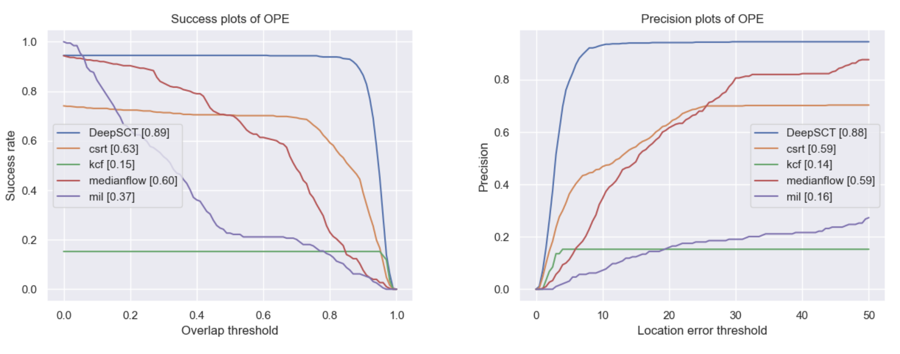

+++
title = "DeepSCT: Deep Learning Based Self Correcting Object Tracking Mechanism"
date = 2021-07-27
authors = ["**Khush Agrawal**", "Rohit Lal", "Himanshu Patil", "Surender Kannaiyan", "Deep Gupta"]
publication_types = ["1"]

url_pdf = "https://drive.google.com/file/d/1Lhq88ID9qK209-JrJxD4_SSqzN2CV6r8/view?usp=sharing"
url_code = 'https://gitlab.com/khushagrawal/self_correcting_tracker'

abstract = "We present a novel mechanism, DeepSCT, to handle the long-term object tracking problem. We build around the premise that the classical tracking algorithms can handle short-term tracking problems efficiently; however, failing in long-term tracking due to occlusion and lost targets. On the other hand, deep learning object detection has higher efficacy but suffers from heavy computational requirements. We present a modular fusion mechanism that inherits higher efficiency and efficacy simultaneously. Finally, we showcase the significant speed and precision improvements in the VisDrone-SOT2019 dataset and an application of person following in a custom AirSim drone simulation."
featured = false

publication = "National Conference on Communications"

+++

#### DeepSCT Architecture

An abstract block diagram of the proposed DeepSCT mechanism demonstrating the passage of data between the individual sub-blocks. The target is #rst acquired from the camera and fed into the Deep-SCT block for continuous tracking while also correcting compounded errors. This correction is achieved due to a continuous feedback loop mechanism using re-identification and detection sub-blocks. Note: Dotted line indicates a one-time initialization procedure.
### DeepSCT for long-horizon tracking and occlusion handling
We adopted the standard method: success and precision plots to evaluate the performance of our mechanism against some of the standard classical computer vision baselines. We perform One Pass Evaluation (OPE) for our mechanism on the VisDrone-2019 test dataset [1]. We present the tests we conducted on our mechanism on a multitude of test cases covering variable lighting, camera orientation, and object sizes. We tested DeepSCT on the VisDrone-SOT2019 dataset for a person-tracking task. We show that DeepSCT consistently outperforms the classical trackers in short-term and long-term tracking problems. We also show that DeepSCT can handle occlusions better than the classical trackers.
<iframe width="854" height="480" src="https://www.youtube.com/embed/Pv83zx7Kjmo" title="VisDrone-SOT2019 Qualitative visualization | DeepSCT" frameborder="0" allow="accelerometer; autoplay; clipboard-write; encrypted-media; gyroscope; picture-in-picture; web-share" allowfullscreen></iframe>

#### Quantitative results

The success and precision plots for evaluating DeepSCT (indicated in blue) against the baseline classical CV algorithms in long-term sequences. DeepSCT scored notably higher AUC scores outperforming all of the baseline trackers. Compared to short-term tracking, DeepSCT provides a considerably higher improvement for long-term tracking. Furthermore, the improvement is significant when the threshold is reasonable.

### AirSim drone simulation
Similar to the previous section, we adopt the standard success, and precision curves to evaluate the DeepSCT mechanism for the custom AirSim drone simulation environment. Accordingly, we perform One Pass Evaluation (OPE) by simulating ten trajectories while incorporating several instances of occlusion, viewpoint, and lighting changes. We also calculate the Area Under Curve (AUC) for both the plots for all tested algorithms and show these in the quantitative results. The plots clearly illustrate that the DeepSCT mechanism outperforms all of the classical algorithms by a significant margin. This significant difference in performance is a result of the inherent correcting nature of the DeepSCT mechanism. While other algorithms are unable to recover in cases of failure, DeepSCT can still recover. As a result, classical methods fail severely in long-term trajectories.
<iframe width="854" height="480" src="https://www.youtube.com/embed/s6AolOzSZmw" title="Drone simulation | DeepSCT" frameborder="0" allow="accelerometer; autoplay; clipboard-write; encrypted-media; gyroscope; picture-in-picture; web-share" allowfullscreen></iframe>

#### Quantitative results

The success and precision plots for comparing DeepSCT (indicated in blue) against the baseline classical computer vision algorithms. It is clear from the plots that DeepSCT outperforms the other trackers by a significant margin).

### References
[1] Du, Dawei, Pengfei Zhu, Longyin Wen, Xiao Bian, Haibin Ling, Qinghua Hu, Jiayu Zheng et al. "VisDrone-SOT2019: The vision meets drone single object tracking challenge results." In Proceedings of the IEEE/CVF International Conference on Computer Vision Workshops, pp. 0-0. 2019.